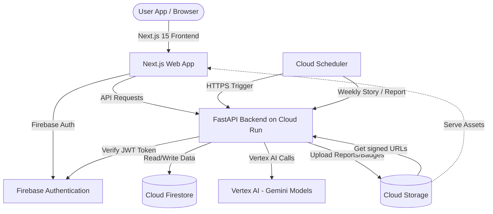

# EcoMind AI - Turn Carbon Data into Everyday Action

**EcoMind AI** is an AI-powered Carbon Footprint Awareness and Behavioral Change Platform designed for the **PromptWars Virtual Challenge 3**. 

Unlike conventional carbon calculators that only display sterile charts and raw metric tons of CO₂, EcoMind AI translates environmental impact into relatable household metaphors, gamified challenges, and emotional cognitive feedback to drive actual behavioral change in India.

---

## 🗺️ System Architecture



---

## 🌟 Key Features

1. **🔒 Secure Authentication**: Integrated with Firebase Auth supporting Google Login and secure route guarding.
2. **📋 Guided Onboarding Assessment**: A smooth 5-step questionnaire capturing commute distances, diet choices, AC usage, air travel, and shopping frequencies.
3. **🧮 Indian-Context Carbon Engine**: Uses specific emission multipliers adapted for India (e.g. coal-reliant grid intensity ~0.82 kg/kWh, public transport, and auto-rickshaws).
4. **🎭 AI Carbon Persona**: Vertex AI analyzes footprints and maps profiles to distinct archetypes like *Eco Warrior* or *Conscious Improver*.
5. **💬 EcoDeva Coach**: An empathetic, context-aware Vertex AI conversational assistant providing advice, local references, and converting metric emissions to metaphors (e.g., LPG cylinders).
6. **🎛️ Decision Simulator**: Sliders to preview carbon savings instantly, altering the **Living Earth Canvas** landscape in real-time.
7. **📖 Weekly Sustainability Stories**: Generates narratives mapping user progress to motivational metaphors.
8. **🎨 Living Earth Visualizer**: An HTML5 Canvas rendering trees, river cleanliness, sky colors, clouds, and wildlife dynamically responding to your score.
9. **🏆 Community Arena**: Leaderboards, streaks, and challenges to gamify carbon reductions.

---

## 🛠️ Technology Stack & Services

### Frontend
* **Next.js 15 (App Router)** & **TypeScript**
* **Tailwind CSS** (curated dark-eco green styling theme)
* **Framer Motion** (smooth screen transitions and stepping animations)
* **React Query (TanStack)** (server-state caching)
* **HTML5 Canvas** (real-time Living Earth visualization)

### Backend
* **FastAPI** (Python 3.11)
* **Pydantic v2** (input validation)
* **Pytest** (automated testing)

### Google Cloud & Firebase Integration
1. **Google Cloud Run**: Runs the frontend and backend in lightweight, auto-scaling docker containers.
2. **Vertex AI (Gemini 2.5 Flash)**: Generates personas, weekly stories, coach conversations, and simulator insights.
3. **Cloud Firestore**: Stores user profiles, assessments, leaderboard metrics, streaks, and stories.
4. **Firebase Authentication**: Handles secure user registration and login tokens.
5. **Cloud Storage**: Stores generated sustainability reports, badges, and user certification assets.
6. **Cloud Scheduler**: Dispatches automated cron requests to refresh leaderboards and trigger weekly stories.

---

## 🚀 Setup & Installation (Local Development)

### Prerequisites
- Node.js (v18+)
- Python (v3.11+)
- Google Cloud SDK CLI installed and logged in (`gcloud auth login`)
- Firebase CLI (optional)

### 1. Backend Setup
1. Navigate to the backend folder:
   ```bash
   cd backend
   ```
2. Create a virtual environment and activate it:
   ```bash
   python -m venv venv
   # On Windows (Command Prompt)
   venv\Scripts\activate
   # On Linux/macOS
   source venv/bin/activate
   ```
3. Install dependencies:
   ```bash
   pip install -r requirements.txt
   ```
4. Run the API locally:
   ```bash
   uvicorn app.main:app --host 0.0.0.0 --port 8080 --reload
   ```

### 2. Frontend Setup
1. Navigate to the frontend folder:
   ```bash
   cd ../frontend
   ```
2. Install dependencies:
   ```bash
   npm install
   ```
3. Run the development server:
   ```bash
   npm run dev
   ```
4. Access the web interface at `http://localhost:3000`.

---

## 🧪 Running Tests

Verify the backend calculations and AI prompt templates using Pytest:
```bash
cd backend
pytest -v
```

---

## 🚢 Deployment

Deploy directly to Google Cloud using the root shell runner script:
```bash
chmod +x deploy.sh
./deploy.sh
```
The script will deploy the Firestore rules and trigger a Google Cloud Build step mapping to the `cloudbuild.yaml` file, pushing container images to the registry and launching them on Cloud Run.

---

## 📋 Evaluation Criteria Optimization

- **High Impact (Smart AI & Usability)**: Vertex AI provides structured JSON schemas to deliver consistent outputs. Conversational coaching leverages the latest user profile context to offer highly personalized, local advice.
- **Medium Impact (Code & Scalability)**: Clean separation of concerns (Routers, Services, Schemas). Uses FastAPI dependencies for security checking. Firestore index caching minimizes read cost for leaderboard lists.
- **Low Impact (Accessibility & UX)**: Built dark-mode-first with high contrast ratios, semantic elements, and keyboard navigability. Uses canvas confetti and Framer Motion micro-interactions.
